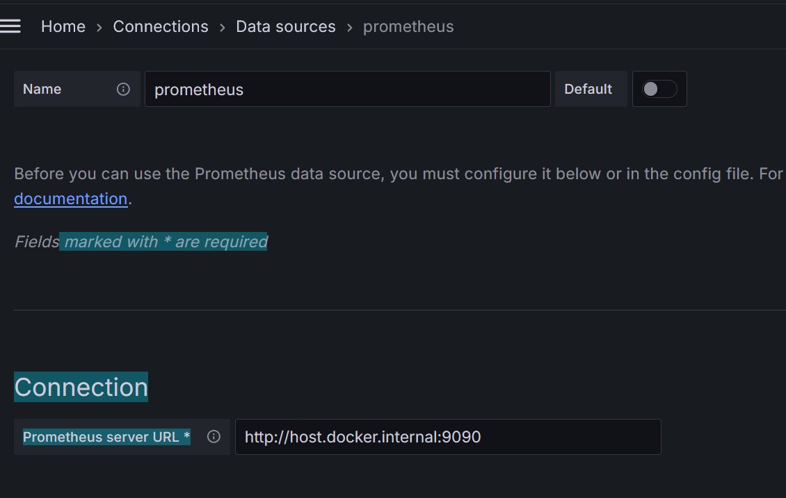

# Monitoring Application

## Goals for final project in the course Systemutveckling med Python
* Create a monitoring application that can monitor the CPU, memory, and disk usage of a computer.
* The application should be able to set alarms for when the usage exceeds a certain percentage.
* The application should be able to log the alarms to a file.
* The application should be able to remove alarms. 
* The application should be able to write alarms to a file in JSON format.
* The application should be able to handle incorrect input without crashing.
* The application should be written with functions.
* The application should use object-oriented programming where it fits.
* The application should be written with functional programming in at least one place. For example, when sorting alarms before displaying them.
## Usage
* Run the application with `python app.py`
* To use the options regarding monitoring, the `Start monitoring` option must be triggered once.
* Grana and Prometheus will be set up automatically when running the application but the user must set up their local Grafana/Prometheus docker containers.
* Prometheus CLient will be running on port 8000 and expose the metrics on `/metrics`.
* Prometheus server is running on port 9090 and the configuration file is located in the root directory.
* Grafana is running on port 3000 and to 
## Configuration
### Pylint
* [Pylint docs](https://pylint.readthedocs.io/en/latest/user_guide/messages/convention/invalid-name.html)
* In settings.json
```
pylint.showNotifications": "onWarning",
    "pylint.importStrategy": "fromEnvironment",
    "pylint.args": [
        "--max-line-length=120",
        "--module-naming-style=camelCase",
        "--variable-naming-style=camelCase",
        "--argument-naming-style=camelCase",
        "--function-naming-style=camelCase",
        "--method-naming-style=camelCase",
        "--attr-naming-style=camelCase",
        "--class-attribute-naming-style=camelCase",
        "--class-naming-style=PascalCase",
        "--disable=C0410,C0121"
    ],
```
### Black formatter
* In settings.json
```
"editor.formatOnSave": true,
    "editor.codeActionsOnSave": {
        "source.organizeImports": "always"
    },
```
### Prometheus/Grafana config
* docker run -d --name prometheus -v /c/chasAcademy/Systemutveckling-Python/monitoringApplication/prometheus.yml:/opt/bitnami/prometheus/conf/prometheus.yml bitnami/prometheus:latest
* For Windows: docker run -d -p 8090:8090 --name prometheus -v "C:\\chasAcademy\\Systemutveckling-Python\\monitoringApplication\\prometheus.yml:/opt/bitnami/prometheus/conf/prometheus.yml" bitnami/prometheus:latest
* du -hs data/wal/00000000 - Check the size of the WAL file
* WAL file - Write Ahead Log file
* Use host.docker.internal instead of localhost - because localhost refers to the container itself.	
* [Prometheus Client](https://github.com/prometheus/client_python/blob/d7c9cd88c7f50097cd86869974301df7615bc9c0/prometheus_client/metrics.py#L264)
* http://localhost:9090/api/v1/query?query=up - Check if Prometheus is up
* http://localhost:8000/metrics
* https://prometheus.io/download/
* https://hub.docker.com/r/grafana/grafana
## 